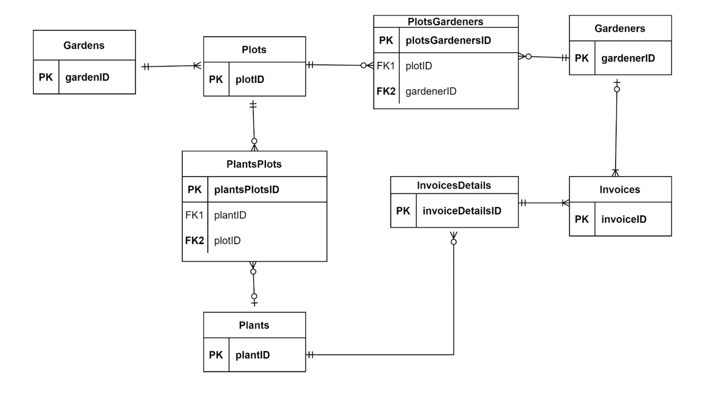
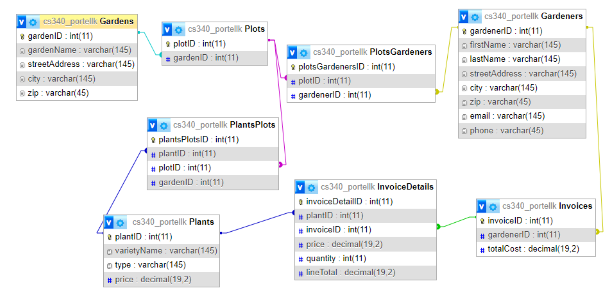

# Database Folder
This folder contains the necessary files to stand up a local database for development purposes. This MySQL, transactional, database is used to store the data for this application. There are three files of importance in this folder:
1. [`ddl.sql`](./ddl.sql) - This file contains the Data Definition Language (DDL) commands to create the database schema and tables.
2. [`dml.sql`](./dml.sql) - This file contains the Data Manipulation Language (DML) commands to populate the database with data.
3. [`cleanup.sql`](./cleanup.sql) - This file contains the commands to drop the database tables.

## Entity Relationship Diagram

## Database Schema
